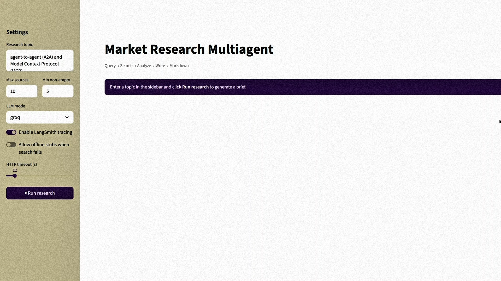
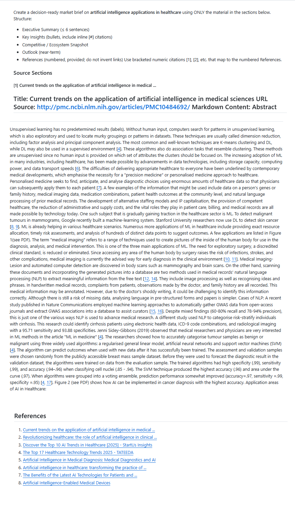
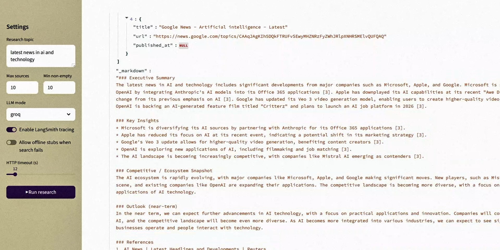

InfoOtter – Market Research Multi-Agent
=======================================

**InfoOtter – Market Research Multi-Agent** is a robust research automation system that combines **LangGraph multi-agent orchestration**, resilient **search and extraction pipelines**, and a **Streamlit interface** to deliver decision-ready market briefs. It is designed to take either a **topic** or a **URL** as input and return a **comprehensive, citation-rich Markdown report** with supporting JSON data.

### **InfoOtter** app here:  
[https://infootter.streamlit.app/](https://infootter.streamlit.app/)

At its core, InfoOtter employs a multi-stage workflow:

- **Researcher Agent** performs web searches using DuckDuckGo (`ddgs`) and Wikipedia fallbacks to collect a wide range of sources.  
- **Extraction Pipeline** converts URLs to structured Markdown using a cascade of tools:  
  1. RapidAPI `url-to-markdown` (when API key is available),  
  2. Tavily Extract API (optional),  
  3. **Jina Reader** (open-source, no key required),  
  4. Local `readability-lxml` + `markdownify` as the final safety net.  
- **Analyst Agent** parses the extracted documents to identify **key facts**, attaching confidence scores and evidence URLs.  
- **Writer Agent** synthesizes all of this into a cohesive report, with inline `[n]` citations tied directly to a **numbered References section**.

---

### Main Interface
A clean and simple Streamlit UI where users can input a topic or URL, configure settings, and launch the multi-agent research pipeline.  


### Generated Report
The core output: a structured, citation-rich Markdown brief with key facts, references, and downloadable artifacts.  


### Reference Summaries
An additional section that provides concise, per-source bullet point summaries, making it easy to scan insights from each reference.  



Features
--------------

*   **Multi-agent graph** (LangGraph) orchestrates:
    1.  Researcher → web search & source gathering
    2.  Analyst → extract key facts (with evidence URLs)
    3.  Writer → synthesize a **full brief** with inline citations + References
       
*   **URL → Markdown extraction** uses a _resilient cascade_:
    1.  RapidAPI url-to-markdown (if key provided)
    2.  Tavily Extract API (if key provided)
    3.  **Jina Reader** _(no key, open endpoint)_
    4.  Local readability/markdownify fallback
        
*   **App-side enrichment**: if the brief looks thin, app re-invokes your writer using the enriched source contents to guarantee a full report.
*   **Reference Summaries**: LLM produces 3–6 bullet summaries _per source_, inserted **right after the References**.
*   **Artifacts** always saved (Cloud-safe temp dir): brief.md, sample\_output.json.
    
Project layout
-----------------
```
├─ app.py                     # Streamlit UI, robust imports, writer fallback, ref summaries
├─ src/
│  ├─ __init__.py
│  ├─ graph.py                # builds LangGraph and exports `compiled`
│  ├─ state.py                # GraphState dataclass / typing
│  ├─ agents.py               # get_llm, run_researcher, run_analyst, run_writer
│  ├─ observability.py        # get_callbacks (LangSmith) – optional
│  ├─ fallbacks.py            # retry helpers (optional)
│  ├─ tools/
│  │  ├─ search.py            # ddgs (DuckDuckGo) + Wikipedia fallback
│  │  └─ url2md.py            # URL→Markdown cascade (Rapid → Tavily → Jina → local)
├─ artifacts/                 # outputs (local CLI run)
├─ .streamlit/
│  └─ config.toml            # Streamlit configs
├─ requirements.txt
└─ .env.example               # optional for local
```
Requirements
---------------
```pip install -r requirements.txt```    

> If your old env used duckduckgo-search, remove it and install **ddgs** (the maintained package).

Environment variables
------------------------

All can be set via .env (local) **or** ~/.streamlit/secrets.toml (Streamlit Cloud).

**Core (recommended):**
```
*   GROQ\_API\_KEY – for the writer/analyst LLM (e.g. llama3-70b).
*   GROQ\_MODEL (default llama-3.3-70b-versatile)
*   HTTP\_TIMEOUT (default 12) – cold containers benefit from 20–30s.
```

**Extraction (optional; app works without them thanks to Jina fallback):**

*   RAPIDAPI\_KEY
*   URL2MD\_HOST (default url-to-markdown-api.p.rapidapi.com)  
*   URL2MD\_BASE (default https://url-to-markdown-api.p.rapidapi.com)
*   URL2MD\_ENDPOINT (default /convert)
*   TAVILY\_API\_KEY
    

**Search & telemetry (optional):**

*   LANGSMITH\_ENABLED (true|false)
*   LANGCHAIN\_API\_KEY, LANGCHAIN\_PROJECT, LANGCHAIN\_ENDPOINT
*   MAX\_SOURCES (default 10)
*   MIN\_NON\_EMPTY\_SOURCES (default 5)
    

### Example .env (local)
```
GROQ_API_KEY=sk_...
GROQ_MODEL=llama3-70b-8192
HTTP_TIMEOUT=20

# optional
RAPIDAPI_KEY=...
TAVILY_API_KEY=...
LANGSMITH_ENABLED=true
LANGCHAIN_API_KEY=...
LANGCHAIN_PROJECT=market-brief
LANGCHAIN_ENDPOINT=https://api.smith.langchain.com
```

### Example .streamlit/secrets.toml (Cloud)

```
GROQ_API_KEY = "sk_..."
GROQ_MODEL   = "llama3-70b-8192"
HTTP_TIMEOUT = 20

# optional extractors
RAPIDAPI_KEY = "..."
TAVILY_API_KEY = "..."

# optional tracing
LANGSMITH_ENABLED = "true"
LANGCHAIN_API_KEY = "..."
LANGCHAIN_PROJECT = "market-brief"
LANGCHAIN_ENDPOINT = "https://api.smith.langchain.com"
```

Running locally
------------------

### 1) Install

```
python -m venv .venv
source .venv/bin/activate    # Windows: .venv\Scripts\activate
pip install -U pip
pip install -r requirements.txt
cp .env.example .env         # fill as needed
```

### 2) CLI pipeline (writes artifacts/)

```
python -m src.graph
# Enter the topic when prompted, or:
python -m src.graph "ai in robotics <or topic you wanna research>"
```

Outputs:

*   artifacts/brief.md
*   artifacts/sample\_output.json
    

### 3) Streamlit UI (local)

```streamlit run app.py```

Open [http://localhost:8501](http://localhost:8501) → enter **topic or URL** → **Run**.Download buttons appear under the brief. 

How robustness works (fallbacks)
-----------------------------------

**Search:**

*   Primary: **ddgs** (DuckDuckGo API maintained)
*   Fallback: **Wikipedia** open search + summary
    
**Extract (URL → Markdown):**

*   RapidAPI url-to-markdown _(if RAPIDAPI\_KEY)_
*   Tavily Extract _(if TAVILY\_API\_KEY)_
*   **Jina Reader** https://r.jina.ai/http:// _(no key, open)_
*   Local readability-lxml + markdownify
    

**Write:**

*   If the writer returns a thin body (e.g., only references), the **app re-invokes the project run\_writer** using enriched source contents to force a complete brief.
    
**Import reliability (Streamlit Cloud):**

*   App registers the src package with importlib **before** importing src.graph/src.agents to avoid KeyError: 'src'.
    
**Artifacts & paths:**

*   Cloud uses a temp, writable dir:
    
    *   …/tmp/market\_agent\_artifacts/brief.md
    *   …/tmp/market\_agent\_artifacts/sample\_output.json
        

Output structure
-------------------

The app renders a Markdown brief like:

*   \# Market Brief:
*   **Key Facts** (bullets with evidence links)
*   **References** (numbered, clickable)
*   **Reference Summaries** (per-source 3–6 bullets with \[#n\] inline markers)
    

Two downloads:

*   **brief.md** – full report (includes summaries)
*   **sample\_output.json** – full state: topic, facts, sources, markdown
    

Troubleshooting
------------------

**Only references, no body**

*   Increase HTTP\_TIMEOUT to 20–30s.    
*   Ensure GROQ\_API\_KEY is set.  
*   The app will auto-regenerate with your writer, but if all extractors fail, sources will be empty → check keys/quota.
    
**KeyError: 'src' on Cloud**

*   Already mitigated via importlib in app.py.
*   Ensure src/\_\_init\_\_.py exists and src/graph.py exports compiled.
    
**duckduckgo\_search warnings**

*   Replace with **ddgs** and update imports: from ddgs import DDGS.
    
**LangSmith 401**

*   Disable tracing (LANGSMITH\_ENABLED=false) or provide LANGCHAIN\_API\_KEY + project.
    
**Site blocked / JS-heavy pages**

*   Jina Reader usually works; if not, local readability+markdownify is the last fallback. Consider adding more sources or a different seed URL.
    
Quick checklist
------------------

*   compiled = graph.compile()\_\_all\_\_ = \["compiled"\]
*   src/tools/url2md.py contains the 4-step extractor cascade.
*   requirements.txt includes ddgs (not duckduckgo-search).
*   Secrets set on Cloud (GROQ\_API\_KEY, optional Rapid/Tavily).
*   HTTP\_TIMEOUT ≥ 20 on Cloud.
*   App downloads produce brief.md with **Reference Summaries** section.
    
--------------------

*   Uses open endpoints (Jina Reader) and libraries: LangGraph, LangChain-Groq, ddgs, readability-lxml, markdownify, Streamlit.
*   Respect source website terms of use; this tool is for research/reporting.
    
Support
----------

If you hit an edge case, grab the **JSON** from the download button, open a bug, and include:

*   topic/URL you used,
*   whether you’re on local or Cloud,
*   console logs / screenshots.
-------------

# ***If you made it this far, you’re definitely not leaving without giving a star 🎀***
